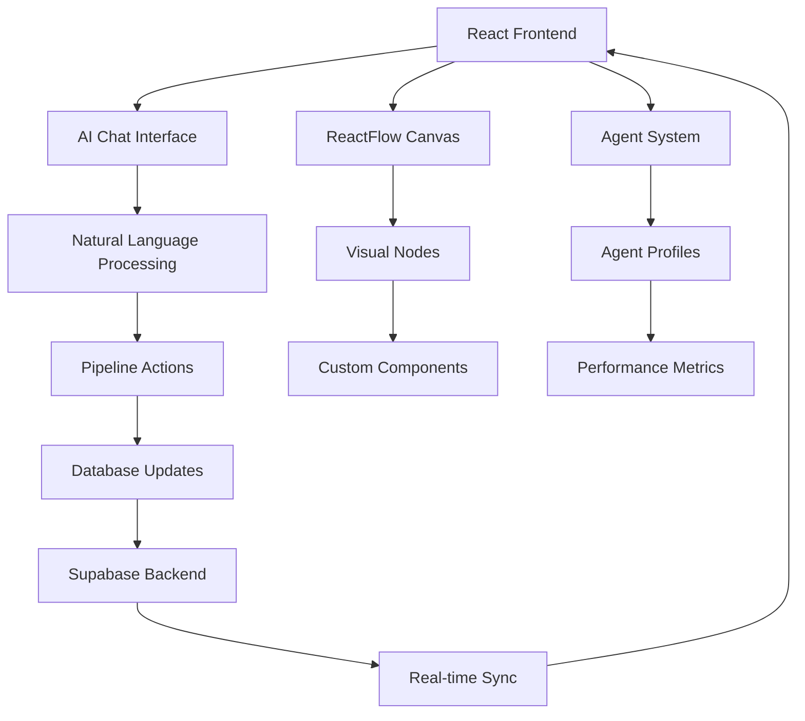

# 🪄 Magic Pipeline - AI-Powered Sales Automation

<div align="center">


*Transform your sales process with AI-powered pipeline automation and natural language interaction*

[🚀 **Live Demo**](#demo) • [📖 **Documentation**](#documentation) • [⚡ **Quick Start**](#quick-start) • [🤝 **Contributing**](#contributing)

</div>

---

## ✨ What is Magic Pipeline?

Magic Pipeline is a revolutionary sales automation platform that combines the visual power of ReactFlow with cutting-edge AI assistance. Design, modify, and optimize your sales pipelines using natural language - just tell our AI assistant what you want, and watch your pipeline come to life!

### 🎯 Key Features

- **🤖 AI-Powered Pipeline Builder** - Create complex sales pipelines using simple conversations
- **🎨 Visual Flow Designer** - Drag-and-drop interface powered by ReactFlow
- **👥 Intelligent Agent System** - 4 specialized AI agents handle different pipeline stages
- **💾 Real-time Persistence** - All changes saved instantly to Supabase
- **📊 JSON Export** - Clean data export for automation and integrations
- **🔄 Live Sync** - Real-time updates across your entire team
- **📱 Responsive Design** - Works beautifully on desktop, tablet, and mobile

## 🎪 Meet Your AI Sales Team

### 🎯 **Aria** - Lead Generation & Qualification Specialist
*"I excel at identifying high-quality prospects and conducting initial qualification assessments."*
- Multi-channel prospecting
- BANT qualification
- Lead scoring algorithms
- **Success Rate: 87%**

### 🎪 **Clio** - Demo & Technical Sales Expert  
*"I specialize in product demonstrations and translating features into business benefits."*
- Custom product demos
- Technical objection handling
- ROI calculations
- **Success Rate: 92%**

### 💎 **Ivy** - Deal Closing & Success Specialist
*"I focus on closing deals and ensuring long-term customer success."*
- Negotiation expertise
- Contract management
- Customer success planning
- **Success Rate: 94%**

### 🔄 **Vee** - Recovery & Re-engagement Agent
*"I never give up on opportunities and specialize in reviving stalled deals."*
- Lost deal recovery
- Re-engagement campaigns
- Competitive intelligence
- **Recovery Rate: 76%**

## 🚀 Quick Start

### Prerequisites
- Node.js 18+ installed
- Supabase account (optional - works with demo data)

### Installation

```bash
# Clone the repository
git clone https://github.com/ahmedtawfeeq1/magic-pipeline-ai.git
cd magic-pipeline-ai

# Install dependencies
npm install

# Set up environment (optional)
cp .env.example .env.local
# Edit .env.local with your Supabase credentials

# Start the development server
npm run dev
```

🎉 **That's it!** Your Magic Pipeline will be running at `http://localhost:5173`

## 🎮 How to Use

### 1. **Start a Conversation**
Open the app and chat with Nase7 (our AI assistant):
```
"Create a SaaS sales pipeline"
"Add a qualification stage after lead generation"  
"Assign Aria to handle lead generation"
```

### 2. **Watch the Magic Happen**
- Your pipeline appears visually in real-time
- Drag nodes to reposition them
- Click agents to see detailed profiles
- Switch to JSON view for clean data export

### 3. **Save and Share**
- All changes auto-save to your database
- Export pipeline as JSON for automation
- Share with your team for collaborative editing

## 🏗️ Architecture



### 🛠️ Tech Stack

- **Frontend**: React 18, TypeScript, Vite
- **UI Framework**: Tailwind CSS, Shadcn/ui
- **Flow Engine**: ReactFlow
- **State Management**: React Query (TanStack Query)
- **Backend**: Supabase (Database, Auth, Real-time)
- **Icons**: Lucide React
- **Build Tool**: Vite

## 📖 Documentation

### 🎯 Core Concepts

#### Pipeline Structure
```typescript
interface Pipeline {
  id: string;
  name: string;
  description?: string;
  stages: Stage[];
  agents: Agent[];
}
```

#### AI Chat Commands
| Command | Description | Example |
|---------|-------------|---------|
| `create` | Create new pipeline | "Create a B2B sales pipeline" |
| `add` | Add new stage | "Add demo stage after qualification" |
| `assign` | Assign agent to stage | "Assign Aria to lead generation" |
| `optimize` | Get optimization suggestions | "How can I optimize my pipeline?" |

#### Agent Assignment Matrix
| Stage | Primary Agent | Backup Agent | Specialization |
|-------|---------------|--------------|----------------|
| Lead Generation | Aria | - | Prospecting & Outreach |
| Qualification | Aria | Clio | BANT Assessment |
| Demo | Clio | Ivy | Product Demonstration |
| Proposal | Clio | Ivy | Solution Design |
| Negotiation | Ivy | Vee | Deal Closing |
| Closed Won | Ivy | - | Success Management |
| Recovery | Vee | Aria | Re-engagement |

### 🔧 Configuration

#### Environment Variables
```bash
# Required for database functionality
VITE_SUPABASE_URL=your_supabase_url
VITE_SUPABASE_ANON_KEY=your_supabase_anon_key

# Optional configuration  
VITE_APP_NAME="Magic Pipeline"
VITE_ENABLE_ANALYTICS=false
VITE_ENABLE_DEBUG=true
```

#### Database Schema
See [SETUP.md](./SETUP.md) for complete database setup instructions.

## 🚀 Deployment

### Vercel (Recommended)
```bash
# Install Vercel CLI
npm i -g vercel

# Deploy
vercel --prod
```

### Netlify
```bash
# Build for production
npm run build

# Deploy dist folder to Netlify
```

### Docker
```dockerfile
FROM node:18-alpine
WORKDIR /app
COPY package*.json ./
RUN npm ci --only=production
COPY . .
RUN npm run build
EXPOSE 3000
CMD ["npm", "run", "preview"]
```

## 🧪 Testing

```bash
# Run unit tests
npm run test

# Run e2e tests
npm run test:e2e

# Type check
npm run type-check

# Lint code
npm run lint
```

## 🤝 Contributing

We love contributions! Here's how to get started:

1. **Fork the repository**
2. **Create a feature branch**: `git checkout -b feature/amazing-feature`
3. **Make your changes** and add tests
4. **Run the test suite**: `npm run test`
5. **Commit your changes**: `git commit -m 'Add amazing feature'`
6. **Push to the branch**: `git push origin feature/amazing-feature`
7. **Open a Pull Request**

### 🐛 Bug Reports
Found a bug? Please [open an issue](https://github.com/ahmedtawfeeq1/magic-pipeline-ai/issues) with:
- Steps to reproduce
- Expected behavior
- Actual behavior
- Screenshots (if applicable)

### 💡 Feature Requests
Have an idea? We'd love to hear it! [Open an issue](https://github.com/ahmedtawfeeq1/magic-pipeline-ai/issues) and describe:
- The problem you're trying to solve
- Your proposed solution
- Why this would be valuable

## 📋 Roadmap

### 🎯 Version 2.0
- [ ] **Advanced AI Integration** - Connect to OpenAI/Anthropic APIs
- [ ] **Team Collaboration** - Real-time multiplayer editing
- [ ] **Pipeline Analytics** - Conversion tracking and insights
- [ ] **Template Marketplace** - Community-shared pipeline templates
- [ ] **API Endpoints** - RESTful API for external integrations

### 🔮 Future Enhancements
- [ ] **Mobile App** - Native iOS/Android applications
- [ ] **Slack Integration** - Pipeline notifications and updates
- [ ] **CRM Connectors** - Salesforce, HubSpot, Pipedrive integration
- [ ] **Workflow Automation** - Zapier/Make.com integration
- [ ] **Advanced Reporting** - Business intelligence dashboard

## 📄 License

This project is licensed under the MIT License - see the [LICENSE](LICENSE) file for details.

## 🙏 Acknowledgments

- **ReactFlow Team** - For the incredible flow visualization library
- **Supabase Team** - For the amazing backend-as-a-service platform
- **Shadcn** - For the beautiful UI component library
- **Vercel Team** - For the fantastic deployment platform

---

<div align="center">

**Built with ❤️ by [Ahmed Tawfeeq](https://github.com/ahmedtawfeeq1)**

[⭐ Star this repo](https://github.com/ahmedtawfeeq1/magic-pipeline-ai) • [🐛 Report Bug](https://github.com/ahmedtawfeeq1/magic-pipeline-ai/issues) • [🚀 Request Feature](https://github.com/ahmedtawfeeq1/magic-pipeline-ai/issues)

</div>